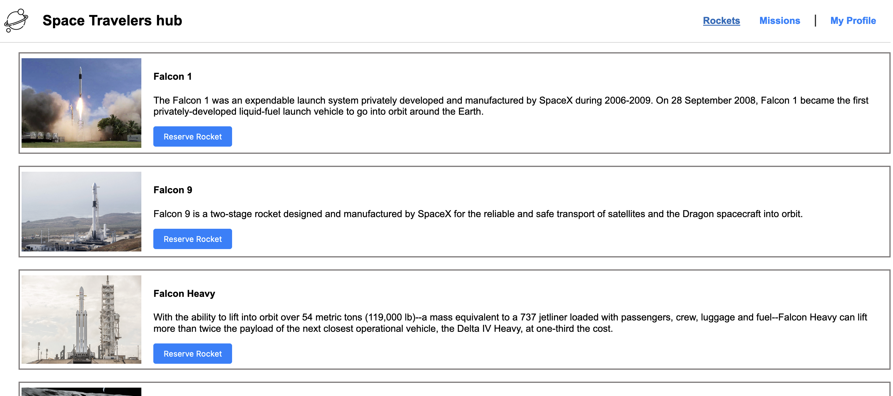

<a name="readme-top"></a>

<div align="center">
  <!-- 
  <br/> -->

  <h3><b>Space Travelers' Hub</b></h3>

</div>

# 📗 Table of Contents

- [📗 Table of Contents](#-table-of-contents)
- [📖 Space Travelers' Hub ](#-space-travelers-hub-)
  - [Screenshot ](#screenshot-)
  - [🛠 Built With ](#-built-with-)
    - [Tech Stack ](#tech-stack-)
    - [Key Features ](#key-features-)
  - [🚀 Live Demo ](#-live-demo-)
  - [💻 Getting Started ](#-getting-started-)
    - [Prerequisites](#prerequisites)
    - [Setup](#setup)
    - [Install](#install)
    - [Usage](#usage)
      - [`npm start`](#npm-start)
    - [Run tests](#run-tests)
      - [`npm test`](#npm-test)
  - [👥 Authors ](#-authors-)
  - [🤝 Contributing ](#-contributing-)
  - [⭐️ Show your support ](#️-show-your-support-)
  - [🔭 Future Features ](#-future-features-)
  - [Acknowledgements ](#acknowledgements-)
  - [📝 License ](#-license-)

# 📖 Space Travelers' Hub <a name="about-project"></a>

**Space Travelers' Hub** is a simple app that fetches data from SpaceX API and provide the ability to reserve rockets and join missions. Built with <a href="https://reactjs.org/">React.js</a>

## Screenshot <a name="screenshot"></a>

<div align='center'>
  
    <br/>
</div>

## 🛠 Built With <a name="built-with"></a>

### Tech Stack <a name="tech-stack"></a>

<details>
  <summary>Client</summary>
  <ul>
    <li><a href="https://reactjs.org/">React.js</a></li>
  </ul>
</details>

<!-- Features -->

### Key Features <a name="key-features"></a>

- **[Single Page Application]**
- **[Reusable Components]**
- **[Client side routing]**
- **[Use remote data from API]**

<p align="right">(<a href="#readme-top">back to top</a>)</p>

<!-- LIVE DEMO -->
https://space-travelers-hub-qfz3.onrender.com/

## 🚀 Live Demo <a name="live-demo"></a>

- [Live Demo Link](https://space-travelers-hub-qfz3.onrender.com)

<p align="right">(<a href="#readme-top">back to top</a>)</p>

<!-- GETTING STARTED -->

## 💻 Getting Started <a name="getting-started"></a>

To get a local copy up and running, follow these steps.

### Prerequisites

In order to run this project you need:

- Node
- npm

Probably with versions:

- Node >= 19.6.0
- npm >= 9.4.0

### Setup

Clone this repository to your desired folder:

```sh
  cd my-folder
  git clone git@github.com:mohamedSabry0/space_travelers_hub.git
```

### Install

Install this project with:

```sh
  cd space_travelers_hub
  npm i
```

### Usage

To run the project, execute the following command:

#### `npm start`

Runs the app in the development mode.\
Open [http://localhost:3000](http://localhost:3000) to view it in your browser.

The page will reload when you make changes.\
You may also see any lint errors in the console.

### Run tests

To run tests, run the following command:

#### `npm test`

Launches the test runner in the interactive watch mode.\
See the section about [running tests](https://facebook.github.io/create-react-app/docs/running-tests) for more information.

<p align="right">(<a href="#readme-top">back to top</a>)</p>

<!-- AUTHORS -->

## 👥 Authors <a name="authors"></a>

👤 **Mohamed Sabry**

- GitHub: [@mohamedSabry0](https://github.com/mohamedSabry0)
- Twitter: [@mohsmh0](https://twitter.com/mohsmh0)
- LinkedIn: [LinkedIn](https://www.linkedin.com/in/mohamed-sabry0/)

👤 **Cimena Kayemba**

- GitHub: [@kayembajonathan](https://github.com/KAYEMBAJONATHAN)
- LinkedIn: [@kayembajonathan](https://www.linkedin.com/in/cimena-kayemba-b56247236/)
- Twitter: [@JonathanKa97287](@JonathanKa97287)

<p align="right">(<a href="#readme-top">back to top</a>)</p>

<!-- CONTRIBUTING -->

## 🤝 Contributing <a name="contributing"></a>

Contributions, issues, and feature requests are welcome!

Feel free to check the [issues page](https://github.com/mohamedSabry0/space_travelers_hub/issues).

<p align="right">(<a href="#readme-top">back to top</a>)</p>

<!-- SUPPORT -->

## ⭐️ Show your support <a name="support"></a>

If you like this project it would be truly appreciated if you give it a ⭐️.

<p align="right">(<a href="#readme-top">back to top</a>)</p>

## 🔭 Future Features <a name="future-features"></a>

- [ ] **[Preserve actions with local storage]**

<p align="right">(<a href="#readme-top">back to top</a>)</p>

## Acknowledgements <a name="acknowledgements"></a>

we are grateful for these resources as they were a reason that we obtained a glimpse of their abundance of knowledge:

- [Microverse](https://www.microverse.org/)
- [ReactJS Docs](https://reactjs.org/docs)
- [React Router Docs](https://reactrouter.com/en/main)
- [Redux toolkit usage guide](https://redux-toolkit.js.org/usage/usage-guide)
- @gitdagray [react_redux_toolkit tutorial](https://www.youtube.com/watch?v=93CR_yURoII)
- https://codepen.io/ilPas/pen/jYeEyV
- We also thank other resources that might have slipped from my mind to mention, We really appreciate all the efforts in delivering helpful resources of knowledge.

<p align="right">(<a href="#readme-top">back to top</a>)</p>

<!-- LICENSE -->

## 📝 License <a name="license"></a>

This project is [MIT](./MIT.md) licensed.

<p align="right">(<a href="#readme-top">back to top</a>)</p>
